# Le Protocole HTTP 

---

## TP 1 

### 1.1 Ouvrir les DevTools

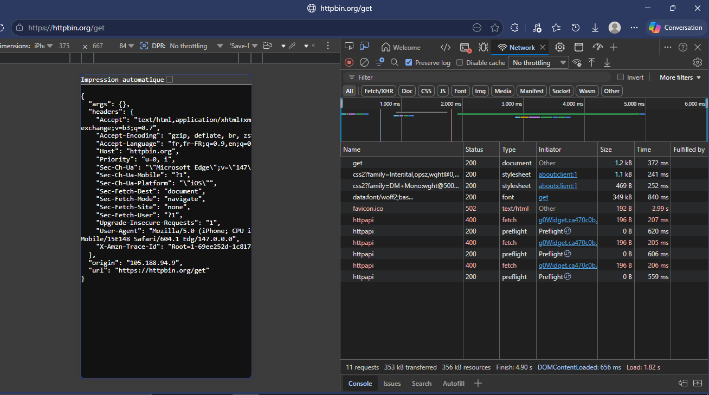


---

### 1.2 Observer une requête simple

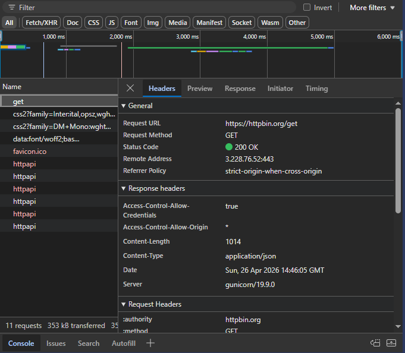


**Request headers :**


**Questions :**

- **Quel est le code de statut ?**  
  `200 OK`

- **Quels headers de requête sont envoyés ?**  

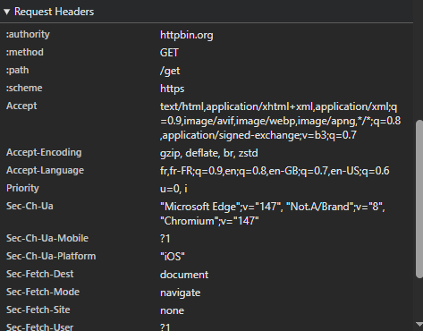

  `Host`, `User-Agent`, `Accept`, `Accept-Language`, `Accept-Encoding`, `Connection`

- **Quel est le Content-Type de la réponse ?**  
  `application/json`

---

### 1.3 Tester différentes méthodes

**Cas 1 : GET**


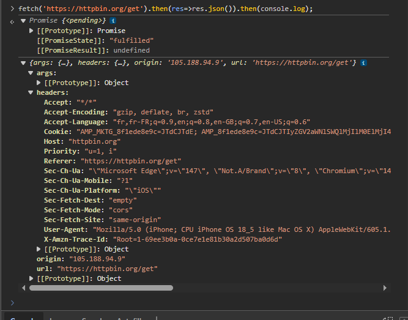


> Promise is fulfilled (réussi)

**Cas 2 : POST**


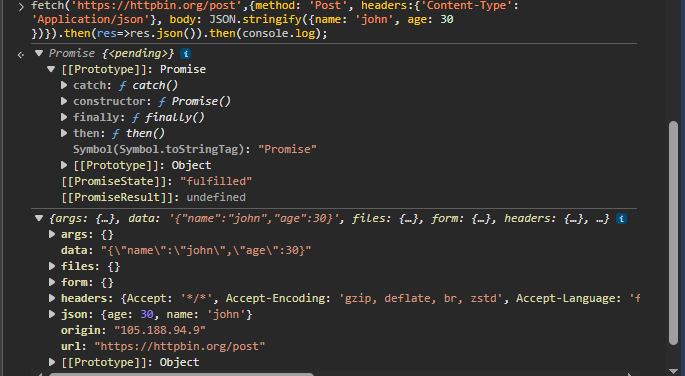


---

### 1.4 Observer les codes de statut

**`https://httpbin.org/status/200`**


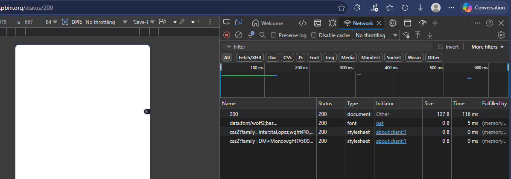


> Réussi

---

**`https://httpbin.org/status/404`**


>  Échoué — Not Found

---

**`https://httpbin.org/status/500`**


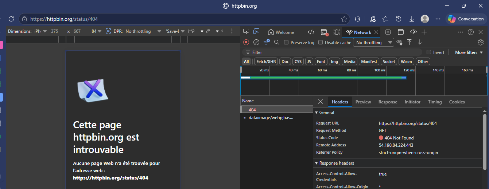


> Internal Server Error

---

**`https://httpbin.org/redirect/3`**

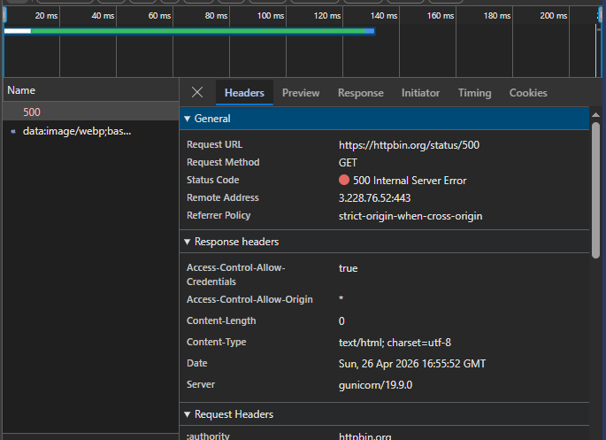


> Page not found

---

### Exercice — Tableau récapitulatif

| URL | Méthode | Code | Content-Type |
|---|---|---|---|
| `httpbin.org/get` | GET | 200 | `application/json` |
| `httpbin.org/post` | POST | 200 | `application/json` |
| `httpbin.org/status/201` | GET | 201 | `application/json` |

---

## TP 2 : Maîtrise de cURL

### 2.1 Requête GET simple


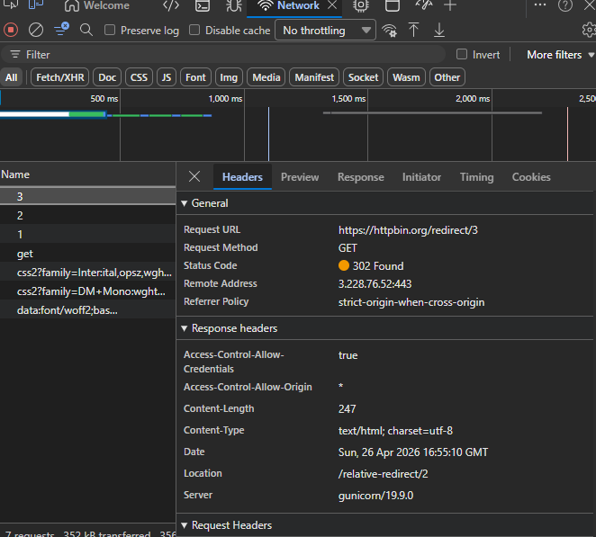
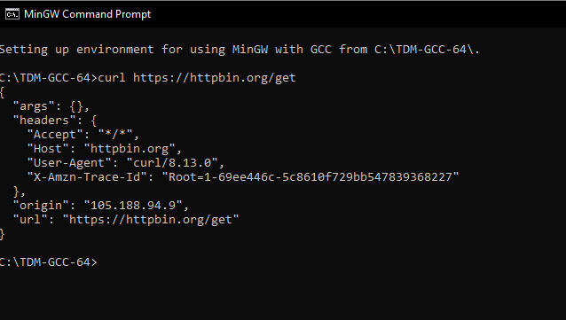
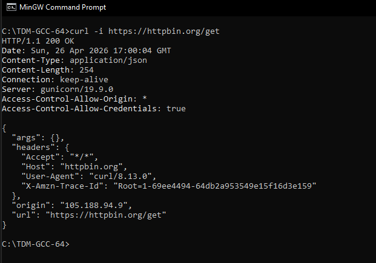


**Question : Quelle est la différence entre `-i` et `-v` ?**

- **`-i`** : montre uniquement les **headers de la réponse** suivis du corps.
- **`-v`** : mode **verbose** — bien plus détaillé, il affiche les headers de requête ET de réponse, la connexion TCP, le handshake TLS, ainsi que les redirections.

---

### 2.2 Requête POST avec données


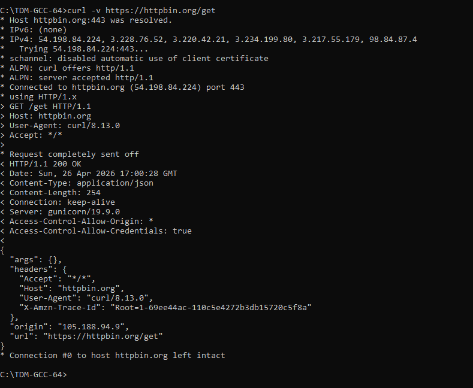


---

### 2.3 Headers personnalisés


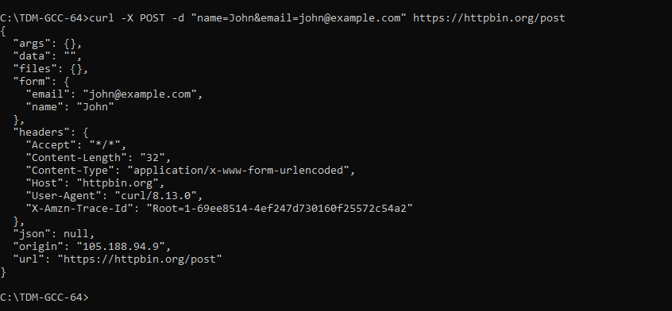


---

### 2.4 Suivre les redirections


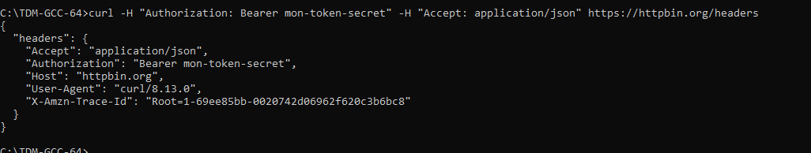

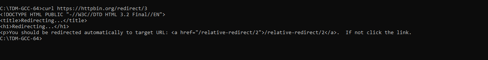
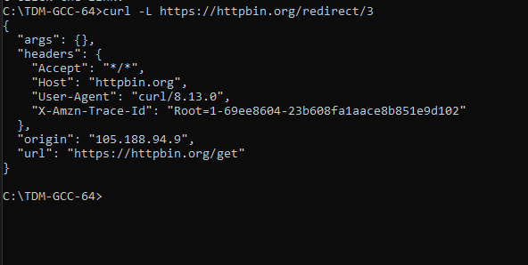
---

### 2.5 Télécharger un fichier


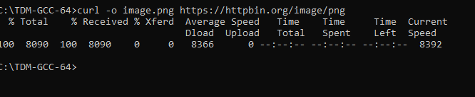
l'image obtenu

> Les deux fichiers sont enregistrés.

---

### Exercice avancé

La commande écrite :

```bash
curl -i -X POST https://httpbin.org/post \
  -H "Content-Type: application/json" \
  -H "X-Custom-Header: MonHeader" \
  -d '{"action": "test", "value": 42}'
```

**Résultat :**


---

## TP 3 : API REST avec JavaScript

### Fonction `fetchWithRetry`

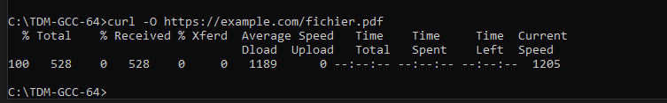

```javascript
async function fetchWithRetry(url, options = {}, maxRetries = 3) {
  let lastError;

  for (let attempt = 1; attempt <= maxRetries; attempt++) {
    try {
      const response = await fetch(url, options);
      if (response.status >= 500) {
        lastError = new Error(`Erreur serveur : HTTP ${response.status}`);
        console.warn(`Tentative ${attempt}/${maxRetries} échouée (${response.status}). Nouvelle tentative dans 1s...`);
        if (attempt < maxRetries) {
          await new Promise(resolve => setTimeout(resolve, 1000));
        }
        continue;
      }
      return response;
    } catch (networkError) {
      lastError = networkError;
      console.warn(`Tentative ${attempt}/${maxRetries} - Erreur réseau : ${networkError.message}`);
      if (attempt < maxRetries) {
        await new Promise(resolve => setTimeout(resolve, 1000));
      }
    }
  }
  throw lastError;
}
```

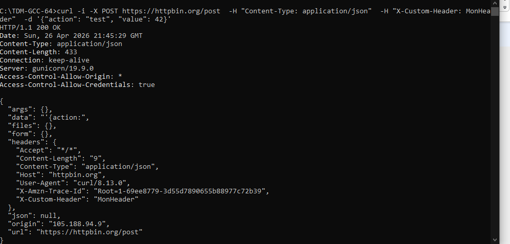

---

## TP 4 : Analyse des Headers de Sécurité

### 4.1 Vérifier les headers d'un site

```bash
curl -s -D - https://github.com -o NUL | findstr /I "strict x-frame x-content content-security"
```

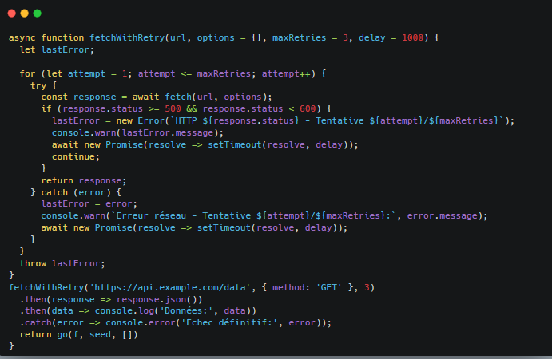

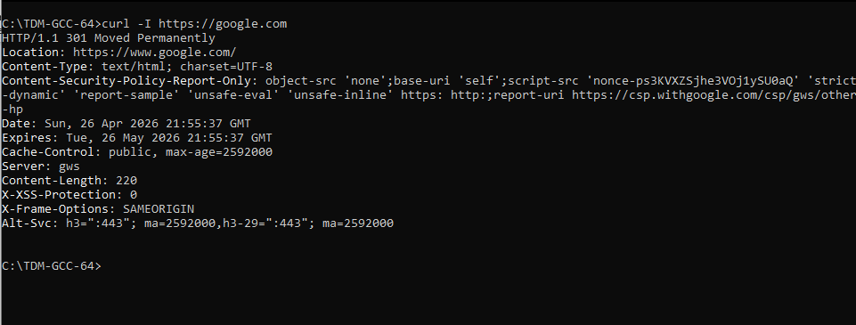
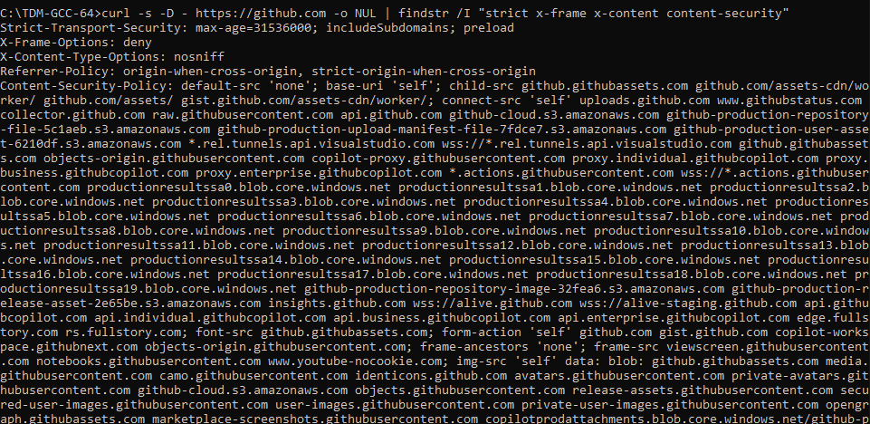
---

### 4.2 Analyser avec Security Headers

On accède à [https://securityheaders.com](https://securityheaders.com)


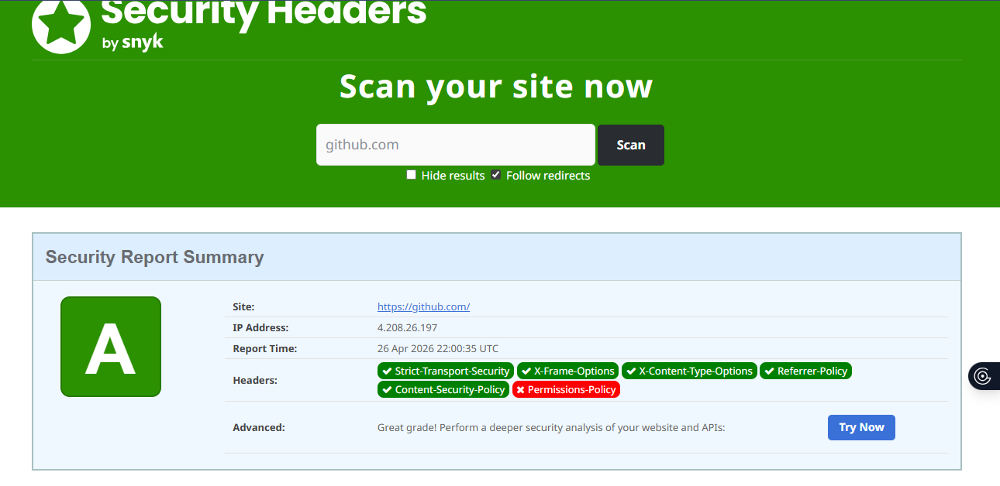
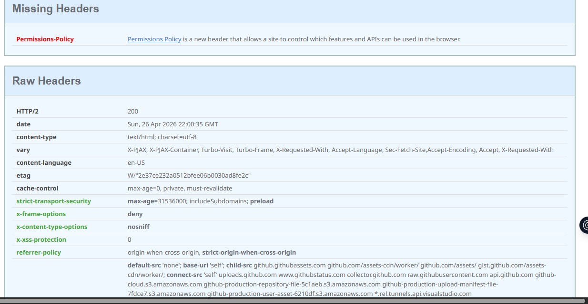
---

### Exercice — Analyse de 3 sites

| Site | HSTS | X-Frame-Options | CSP | Note |
|---|---|---|---|---|
| `github.com` | `max-age=31536000; includeSubDomains; preload` | `DENY` | Politique stricte | **A+** |
| `google.com` | `max-age=31536000; includeSubDomains; preload` | `SAMEORIGIN` | Politique complexe | **A** |
| `httpbin.org` | Absent | Absent | Absent | **F** |
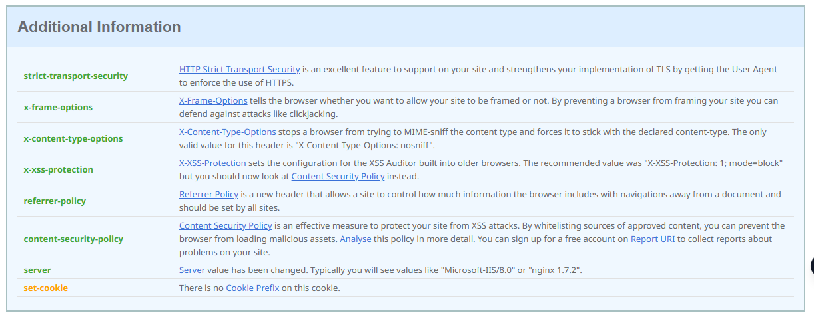


---

## TP 5 : Cache HTTP

### 5.1 Observer le cache


---

### 5.2 Requête conditionnelle

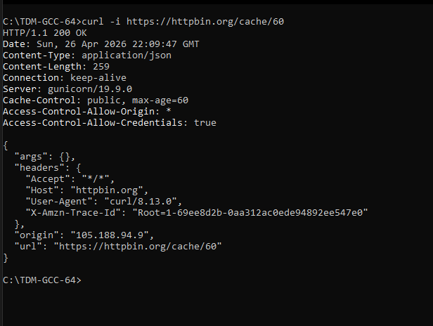

---

### 5.3 

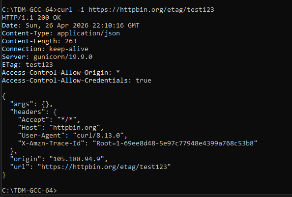

---

## Exercices Récapitulatifs

### Exercice 2 :

**1. la différence entre `no-cache` et `no-store` ?**

- **`no-cache`** : le navigateur peut stocker la réponse en cache, mais il **doit valider** auprès du serveur avant de l'utiliser (via ETag ou Last-Modified). Si la ressource n'a pas changé, le serveur répond `304 Not Modified`.
- **`no-store`** : rien n'est stocké — ni en cache disque, ni en mémoire. La ressource est re-téléchargée à chaque visite. Réservé aux données sensibles (ex : pages bancaires).

---

**2. Pourquoi POST n'est-il pas idempotent ?**

Parce que chaque appel POST ou déclenche une nouvelle action côté serveur. on doit envoyer deux fois la même requête POST sur `/posts` crée deux articles distincts.

 À l'inverse, PUT est idempotent : le même appel répété produit le même résultat.

---

**3. Que se passe-t-il si le serveur renvoie un code 301 ?**

Un `301 Moved Permanently` signifie que la ressource a été **définitivement déplacée** vers l'URL indiquée dans le header `Location`

---

**4. À quoi sert le header `Origin` ?**

Il indique l'**origine de la requête** . Il est utilisé dans le mécanisme **CORS** pour que le serveur décide s'il autorise une requête

---

**5. Pourquoi utiliser `HttpOnly` sur les cookies de session ?**

L'attribut `HttpOnly` empêche JavaScript d'accéder au cookie via `document.cookie`. Cela protège contre les attaques **XSS (Cross-Site Scripting)** 

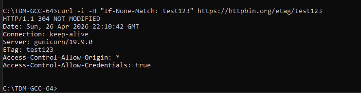